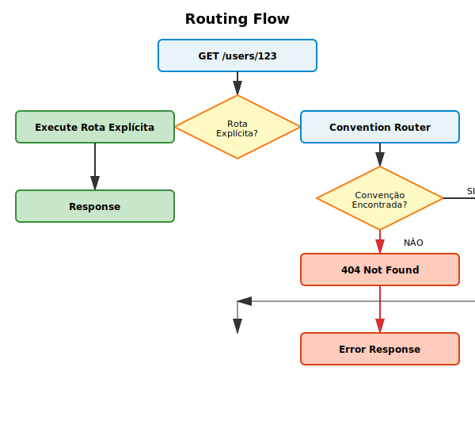

# Routing

O framework oferece dois modos de roteamento:
1. **Explícito** - Você registra rotas manualmente
2. **Por Convenção** - O framework descobre controllers automaticamente

## Rotas Explícitas

### Métodos Disponíveis

```php
$app->get($path, $handler);     // GET
$app->post($path, $handler);    // POST
$app->put($path, $handler);     // PUT
$app->patch($path, $handler);   // PATCH
$app->delete($path, $handler);  // DELETE
$app->options($path, $handler); // OPTIONS
$app->head($path, $handler);    // HEAD
```

### Sintaxes de Handler

```php
// Closure
$app->get('/users', fn (Request $req) => Response::json([]));

// String estilo Laravel
$app->post('/users', 'UserController@create');

// String estilo array
$app->put('/users/{id}', [UserController::class, 'update']);

// Callable
$app->delete('/users/{id}', [$controller, 'delete']);
```

### Parâmetros de Rota

```php
$app->get('/users/{id}/posts/{postId}', function (Request $request) {
    $userId = $request->param('id');
    $postId = $request->param('postId');
    
    return Response::json(['user' => $userId, 'post' => $postId]);
});
```

Parâmetros são extraídos automaticamente da URL.

### Prioridade

Rotas explícitas têm prioridade máxima. A primeira rota que corresponde é usada:

```php
$app->get('/users/me', 'ProfileController@current');  // Executado
$app->get('/users/{id}', 'UserController@show');      // Nunca alcançado para /users/me
```

## Fluxo de Roteamento



## Roteamento por Convenção

Se nenhuma rota explícita corresponde, o framework tenta usar convenção automática:

### Padrão

```
Método HTTP + Path → Namespace + Controller + Action
```

### Exemplos

```
GET /users
→ App\Http\Controller\UsersController::index()

GET /users/list
→ App\Http\Controller\UsersController::list()

POST /users
→ App\Http\Controller\UsersController::create()

GET /products/123/details
→ App\Http\Controller\ProductsController::details()
```

### Mapeamento Automático

| HTTP | Path | Classe | Método |
|---|---|---|---|
| GET | `/users` | UsersController | index (padrão) |
| GET | `/users/list` | UsersController | list |
| GET | `/users/{id}` | UsersController | show (padrão para /{id}) |
| POST | `/users` | UsersController | create |
| PUT | `/users/{id}` | UsersController | update |
| DELETE | `/users/{id}` | UsersController | delete |
| PATCH | `/users/{id}` | UsersController | patch |

### Namespace Padrão

O padrão é `App\Http\Controller\`, mas você pode customizar:

```php
// No seu Application ou bootstrap
define('CONTROLLER_NAMESPACE', 'App\\Controllers\\');
```

### Quando Usar

Use convenção quando:
- ✅ API simples e previsível
- ✅ Seguindo o padrão REST exatamente
- ✅ Poucos customizações

Registre explicitamente quando:
- ❌ Rotas complexas
- ❌ Múltiplos controllers para um endpoint
- ❌ Versioning de API

## Route Matching

### Correspondência de Segmentos

```php
// Exato
GET /health
→ Rota: /health ✓

// Com parâmetro
GET /users/123
→ Rota: /users/{id} ✓

// Múltiplos parâmetros
GET /users/456/posts/789
→ Rota: /users/{userId}/posts/{postId} ✓

// Diferente
GET /users/not-a-number
→ Rota: /users/{id} (ainda corresponde - não há validação de tipo)
```

### Tratamento de 404

Se nenhuma rota corresponde:

```php
throw new HttpException('Not Found', 404);
```

Retorna JSON com erro e `request_id`.

## Exemplo Completo

```php
<?php

use Elavora\Api\Application;
use Elavora\Api\Http\Request;
use Elavora\Api\Http\Response;
use Elavora\Api\Exceptions\HttpException;

$app = Application::create();

// Rotas explícitas (alta prioridade)
$app->get('/health', fn () => Response::json(['status' => 'ok']));

$app->get('/users', 'UsersController@list');
$app->post('/users', 'UsersController@create');
$app->get('/users/{id}', 'UsersController@show');
$app->put('/users/{id}', 'UsersController@update');
$app->delete('/users/{id}', 'UsersController@delete');

// Rotas customizadas
$app->get('/api/v1/users/{id}/profile', 'UserProfileController@show');
$app->post('/auth/login', fn (Request $req) => Response::json(['token' => '...']));

// Fallback: Convenção automática para outros controllers
// GET /posts → PostsController@index
// POST /products/{id}/images → ProductsController@uploadImage (se existir)

$request = \Elavora\Api\Http\Request::fromGlobals();
$response = $app->handle($request);
$app->emit($response);
```

## Boas Práticas

1. **Seja consistente**: Use convenção OU explícito, não misture nos mesmo endpoint
2. **Documente rotas customizadas**: Explícitas devem ser óbvias
3. **Validação em parâmetros**: Sempre valide `{id}` antes de usar
4. **Erros claros**: Use `HttpException` com status codes apropriados

```php
if (!$user = $this->users->find($id)) {
    throw new HttpException('User not found', 404);
}

if (!$this->canDelete($user)) {
    throw new HttpException('Insufficient permissions', 403);
}
```
